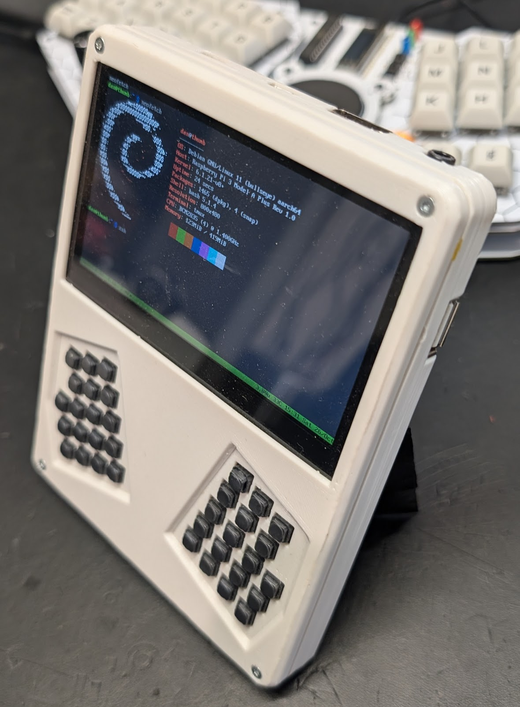

# Build Highlights
In approximately newest to oldest order.  Each build tries something new.  
A few supporting software projects:
* https://github.com/a8ksh4/gpio-keyboard
* https://github.com/a8ksh4/rpi-integrated-battery-module
* https://github.com/a8ksh4/pico_keeb

## Clamshell

[Build Writeup](./clamshell/README.md)

A truely palm-sized palmtop utilizing a 4" dsi LCD in the lid, and a Pi 2, Battery, and
one-handed chording keyboard in the base.  This was intended as a console only build, and I experimented with using gameboy hinges and clean routing for the dispaly ribbon cable.  
The hinges were meh, but still worked.

## Thumb Term

[Build Writeup](./thumb_term/README.md) 

This is the spiritual successor to the Paper Pi build  that I did a couple years before. 
I repurposed the keyboard and added four rear-facing 5-way switches to address my
main complaint about needong to offload some typing load from the thumbs.  This build used 
a Pi 3a, 5" DSI touchscreen LCD, and a Pi Pico for the keyboard and power management.  This
was an experiment with using the Pico to monitor battery voltage and enabling complete 
system shutdown when needed.

* https://hackaday.io/project/191737-thumb-term

## Boopbarry (beepberry knockoff)
This was a fun little build while waiting for the release of the Beepberry (aka Beepy) 
intended to be a barebones simple build.  It utilized a 2.7" sharp memory display, and 
later a JDI 3-bit color display, a Pi Zero, un-boosted 18650 cell for power, and 
chording keyboard with a Pi Pico also monitoring battery voltage.

## Chonky Pocket
https://github.com/a8ksh4/chonky-pocket

An almost pocket-sized portable linux computr with 5" touchscreen, pi 4, and chording 
keyboard wired to gpio and using a bit of python and uinput module to generate keypresses. 
Possibly my favorite build so far.

* https://www.youtube.com/watch?v=c1mzPywM8Vc

## Hinged Cyberdeck
This was an experiment with an alternate form factor and an attempt to do a build around 
an Intel Compute Stick.  It incorporates an artsey.io chording keybord, AmpRipper 4k 5 volt 
power supply, and a 7" touchscreen.

* https://www.youtube.com/watch?v=x9s_VNrKQGE

## Book, aka Little Goose

[Build Writeup](./book_aka_little_goose/README.md)

This was an entry in the Cyberdeck Cafe Datatex build competition - it's a sort of 
digital book, probably a nod toward Stephenson's "The Diamond Age".  It features 
a Pi Zero 2W, 5" touchscreen, one handed chording keyboard, and all day battery life.

* https://www.youtube.com/watch?v=C44CgjK7OkY

## Micro Note
https://github.com/a8ksh4/MicroNote

A short forey into minimalistic computing utilizing MicroPython as the OS on an RP2040
microcontroller with 1" OLED display and a hand wired chording keyboard.  This utilizked 
a modified fbconsole library to support keystroke injection, and micropython threading
to poll the keyboard in parallel to providing an interactive repl.  This was my first
implementatino of a chording keyboard firmware and was the bases for a few other projects.

* https://www.youtube.com/watch?v=s2Yz5-U_l5U
* https://blog.cyberduck.space/2022/08/

## Chonky Palmtop
https://github.com/a8ksh4/chonky-palmtop

Definately the most well known build I've worked on.  Inspored by the thinkpads with 
the pop out keyboard, this build features a fold out mechanical keyboard with miryoku 
layout, a P 4, 7" touchscreen, and decent battery life.

* https://www.youtube.com/watch?v=5uxr-FFjzCg
* https://www.tomshardware.com/news/chonky-raspberry-pi-palmtop-cyberdeck
* https://hackaday.com/2022/04/29/chonky-palmtop-will-slide-into-your-heart/

## Paper Pi Handheld
https://github.com/a8ksh4/paper-pi-handheld

An e-ink linux computer with Pi 4, several hour battery life, and hand wired thumb 
keyboard with Miryoku layout.

* https://hackaday.com/2021/04/27/paper-pi-is-an-ergonomic-cyberdeck-meant-for-thumbs/
