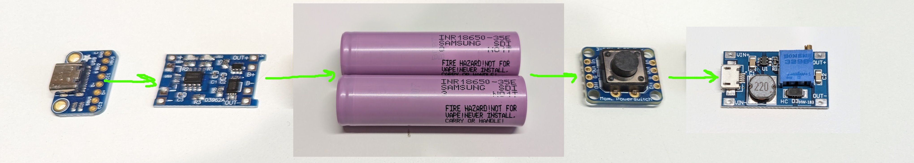

# Clamshell

## Parts List

* [Waveshare 5inch DSI](https://www.amazon.com/gp/product/B0BWN8MKQL/)
* [Raspberry Pi 2 Model B](https://www.raspberrypi.com/products/raspberry-pi-2-model-b/)

**Power**:
* [Adafruit USB-C Breakout board](https://www.adafruit.com/product/4090)
* [1s Li-Ion Charge board](https://www.amazon.com/gp/product/B071RG4YWM/)
* [1s Li-ion Protection Board]()
* [18650 Cells]()
* [Adafruit Pushbutton power switch](https://www.adafruit.com/product/1400)
* [Adjustable boost board](https://www.amazon.com/gp/product/B07RNBJK5F/)
* [Silicon Hookup Wire](https://www.amazon.com/gp/product/B08CC1DLQF/)

**Keyboard**
* [MBK Choc blank keycaps](https://www.littlekeyboards.com/collections/keycaps/products/mbk-choc-low-profile-keycaps)
* [Choc Pro Red 35g key switches](https://www.littlekeyboards.com/collections/keyboard-switches/products/kailh-choc-pro-low-profile-switches?variant=32328459681859)
* Copper Cat5 wires for keyboard
* [Micro USB Connector](https://www.amazon.com/gp/product/B01M0KVDPQ/)
* [Raspberry Pi Pico](https://www.raspberrypi.com/products/raspberry-pi-pico/)

**Misc**:
* [1/4" Screws](https://www.amazon.com/gp/product/B00GDYNHL6/)
* [3/8" Screws](https://www.amazon.com/gp/product/B00GDYNJNM/)

## Power 

This battery, charging, and boost setup works really well for systems using up to about 5V 1A.  The charging board works independently from the power switch and boot board, so charging can happen while the sytstem is in use.  And the pi can be powered on and off without impacting charging.  Also, using a solid state pushbutton power switch let us use the pi pico board to switch system power off if the battery gets run down.

## Case Design
The case is designed in On-Shape, so anyone can view and export it from [here](https://cad.onshape.com/documents/c13a11791200e18eb582bd72/w/562a84649ef1f5f89ed34793/e/3f0dbdffc89a92e9e4e1e7a3?renderMode=0&uiState=671fb0d0aa96675cb058cb98).

Cross section view of the closed unit showing the routing of the display ribbon cable through the back hinge:

## Keyboard

