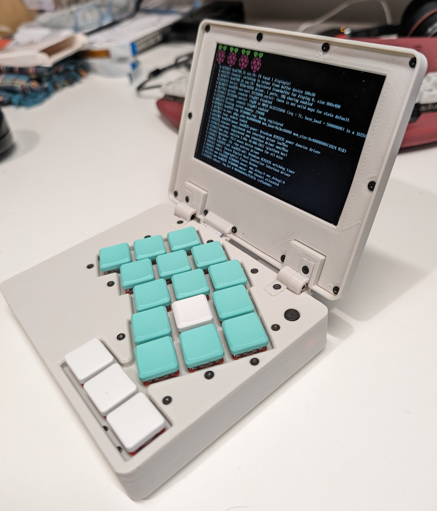
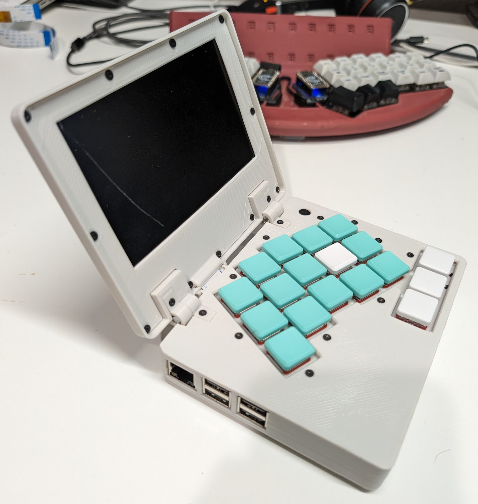
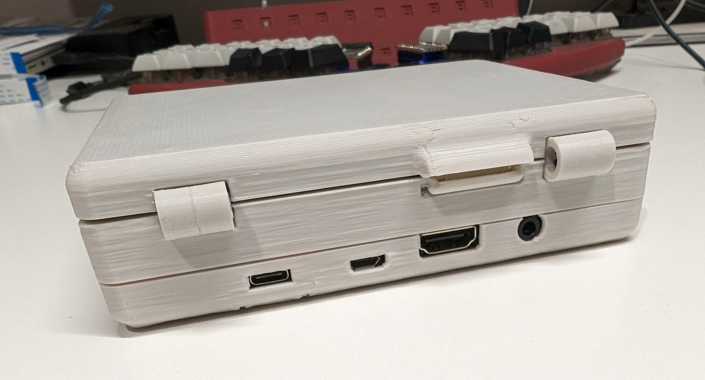
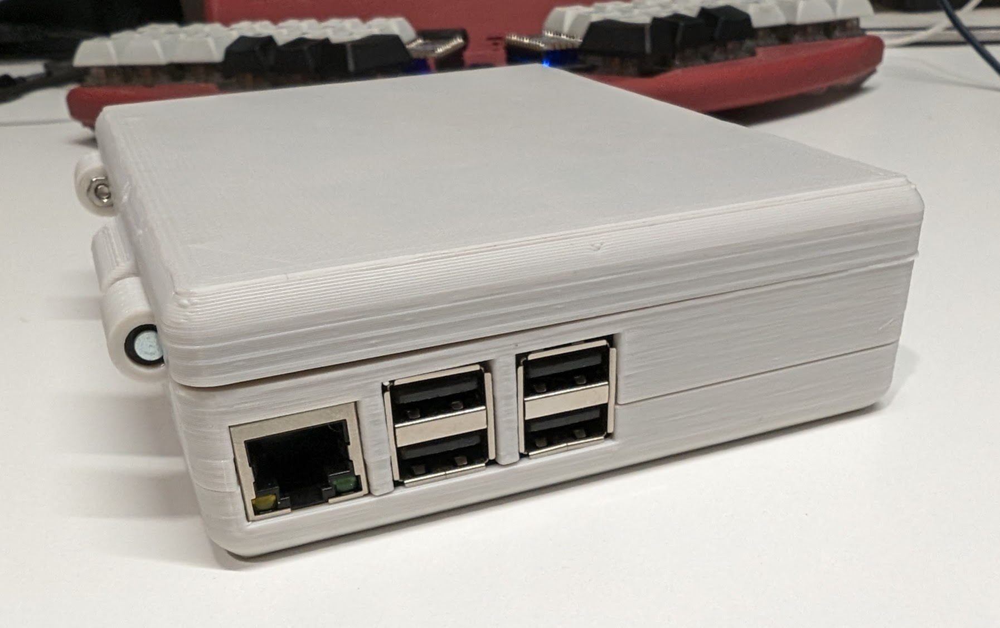
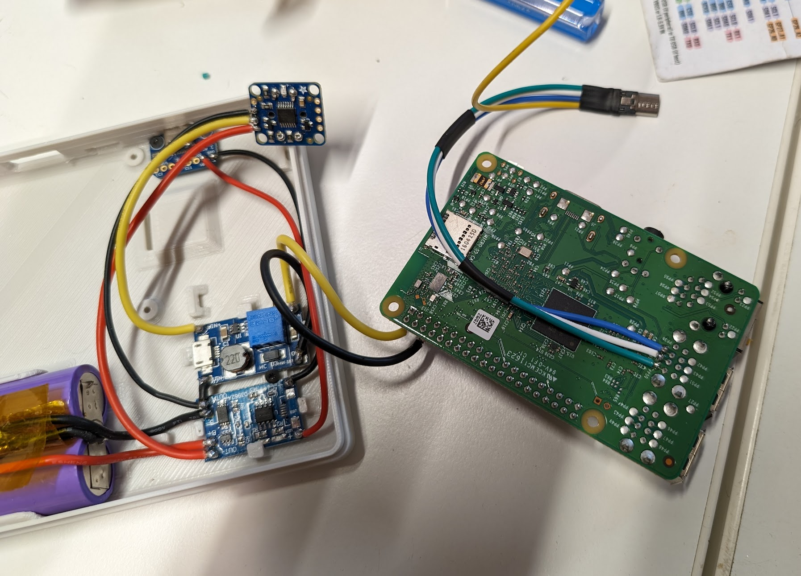
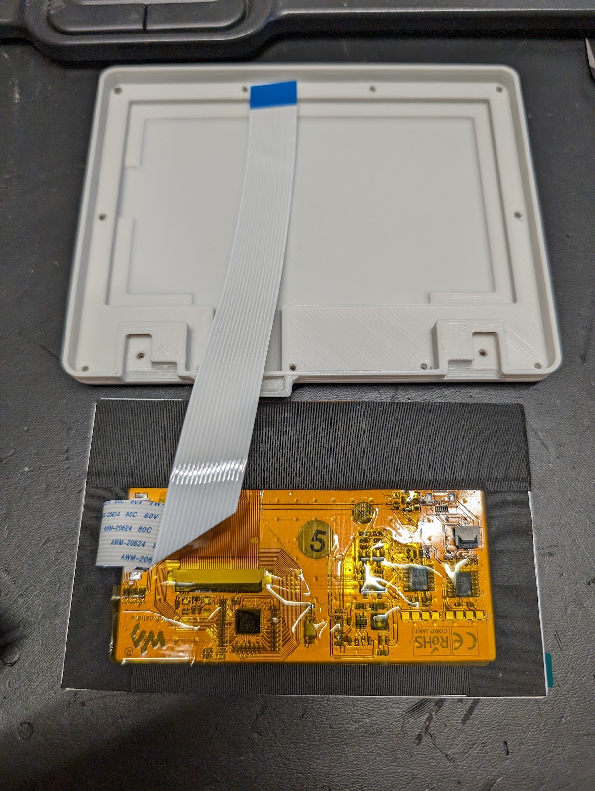
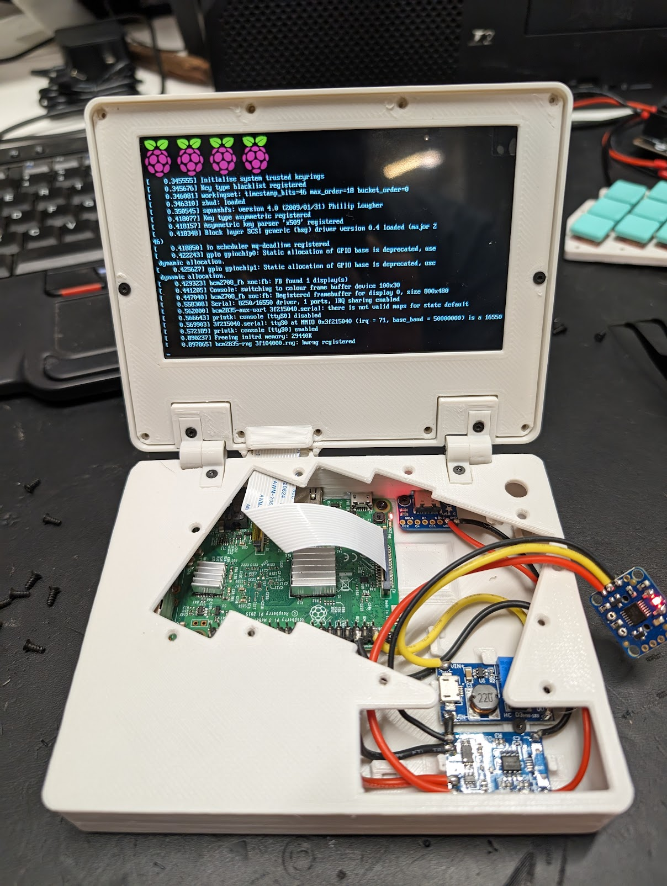

# Clamshell

This was designed to be a compact, one-handed, console-only build.  I experimented with low profile hinges and cleanly routing the DSI ribbon cable from the LCD in the lid to the Pi.  The 5" lcd should work great for console apps, and the Pi 2b only draws a couple hundred milli-amps peak, so should have long battery life.
  

## Parts List

* [Waveshare 5inch DSI](https://www.amazon.com/gp/product/B0BWN8MKQL/)
* [Raspberry Pi 2 Model B](https://www.raspberrypi.com/products/raspberry-pi-2-model-b/)

**Power**:
* [Adafruit USB-C Breakout board](https://www.adafruit.com/product/4090)
* [1s Li-Ion Charge board](https://www.amazon.com/gp/product/B071RG4YWM/)
* [1s Li-ion Protection Board]()
* [18650 Cells]()
* [Adafruit Pushbutton power switch](https://www.adafruit.com/product/1400)
* [Adjustable boost board](https://www.amazon.com/gp/product/B07RNBJK5F/)
* [Silicon Hookup Wire](https://www.amazon.com/gp/product/B08CC1DLQF/)

**Keyboard**
* [MBK Choc blank keycaps](https://www.littlekeyboards.com/collections/keycaps/products/mbk-choc-low-profile-keycaps)
* [Choc Pro Red 35g key switches](https://www.littlekeyboards.com/collections/keyboard-switches/products/kailh-choc-pro-low-profile-switches?variant=32328459681859)
* Copper Cat5 wires for keyboard
* [Micro USB Connector](https://www.amazon.com/gp/product/B01M0KVDPQ/)
* [Raspberry Pi Pico](https://www.raspberrypi.com/products/raspberry-pi-pico/)

**Misc**:
* [1/4" Screws](https://www.amazon.com/gp/product/B00GDYNHL6/)
* [3/8" Screws](https://www.amazon.com/gp/product/B00GDYNJNM/)

## Power 
  

USB-C Port -> 1s Charger Board -> BMS (2p 18650 cells) -> Solid State PW Switch -> Boost Converter -> Raspberry Pi  

  

This battery, charging, and boost setup works really well for systems using up to about 5V 1A.  The charging board works independently from the power switch and boot board, so charging can happen while the sytstem is off or in use.  And the pi can be powered on and off without impacting charging.

The pi pico board that handles the keyboard stuff is conneceted directly to the power switch, before the boost converter, so it can monitor battery voltage from its Vin and signal to the pi if voltage is getting low via serial communication over USB, and it can toggle voltage to the momentary power switch to completely shut off the system power if the battery gets too low. 

A tmux toolbar setting reports system battery voltage to the user.

**Struggles** - I'm not sure why, but I've had trouble reading the battery voltage with this setup.  On a previous build I used a resistor bridge to reduce the peak 4.2v to under 3v for the adc, and then discovered that there was an adc with voltage divider built in and attached to Vin, so cut off the resistors.  So far the built in bridge isn't working on this build.

## Case Design and Display
I tried a couple of new things here.  This was the first time I've routed a DSI ribbon cable through the hinge.  This came out pretty nice....  it would be better perhaps curing the ribbon through a barrel, but it would be getting pretty long and might have impedance probs curled up (?), so having it protected from the back is a nice compromise.

I also wanted to try gameboy hinges for this build - The [Penkesu](https://penkesu.computer/) build used them and looked really slick.  It turns out they don't have enough friction for the weight of the 5" LCD, so I failed-over to using a nut and screw on one side to add friction.  This worked okay-ish... not as well as I'd like.  I'm giong to look at other options next time around.  Hinges are tough.  I do like the look of this setup!

The case is designed in On-Shape, so anyone can view and export it from [here](https://cad.onshape.com/documents/c13a11791200e18eb582bd72/w/562a84649ef1f5f89ed34793/e/3f0dbdffc89a92e9e4e1e7a3?renderMode=0&uiState=671fb0d0aa96675cb058cb98).  

My strategy for designing stuff like this has evolved over the last couple of years.  A few notes:

* I try to re-use drawings as much as possible, so if I make a change, I don't need to update multiple things in the design.
* Everything is modeled in place as multiple parts, as the unit would be assembled. This lets me see if there is any interference between parts and avoiding surprises during print and assembly.
* Hide and unhide parts as needed for visibility whereever sketching and working stuff.  Use the cross-section feature to check for interference with all parts showing.

**Design Process**
* I start with a sketch of the perimeter of the case.  This can be adjusted as things progress to shrink or grow as needed.
* Extrude top, bottom, and lid of the case.
* Add features to each part:
  * Top gets a keyboard sketched onto its face, an opening extruded, and the keyboard plate extruded behind the opening
  * Bottom gets mounting posts for the pi and power components, a clip to hold the battery, and openings in the side for the Pi USB, display, etc ports.
  * The lid is hollowed out for the display and a front bezel extruded to hold the display in.
* Hinges and display ribbon cable routing are added between the lid and top.
* Everything possible gets a fillet to smooth out all of the corners and strengthen everything.

This ends up being a LOT of sketches, extrusions, etc, but everything can be grouped by purpose/component to keep organized.  

Cross section view of the closed unit showing the routing of the display ribbon cable through the back hinge:

**Struggles** - The display has started fritzing after the system boots to console. I haven't root caused it yet to a failing ribbon cable or a software issue.  Also see the notes about the gameboy hinges above.

## Keyboard

This build uses a one-handed chording keyboard that's kind of a mashup of a couple layouts I like.  The top-left 2x4 keys can be chorded in te [artsey.io](artsey.io) layout, and the thumb keys are hold-tap for escape, enter, tab and layer shifts for number, symbol, and navigation layers sort of similar to the [miryoku](https://github.com/manna-harbour/miryoku) layout.

I wanted to either angle the keyboard to one side or put the display on a swivle so I don't have to look at it from the side with the keyboard oriented properly for my hand. Rotating the keyboard seemed the better approach here.  The staggering and rotation angle are set to maximize ergo and fit the keyboard in next to the battery cells.  

**Struggles** - The thumb button arrangement was the result of trying to make three buttons fit next to the 2x 18650 cells in the case... I found it is easier to chord the two thumb buttons than it is to reach for the third button. 

### Firmware
The keyboard uses a [custom circuitpython firmware](https://github.com/a8ksh4/gpio-keyboard) that I've been adapting for a few builds.  It's been a pain for this device since I introduced some bugs that I haven't yet been able to sort out. I've played with passing keypresses over serial to a service that uses the uinput module to generate keypresses, but opted to move from micropython to circuit python in this build so I could have a proper HID usb device.  It still uses a serial device for battery reporting and triggering system processes via a listening service on the pi. A few other convenient features:
* Basic keyboard stuff - oneshot keys, layers
* Chording support
* Generating key combinatinos and sequences
* Executing system commands on a keypress via signals passed over serial to a listening service that runs on the pi.
* Battery/power reporting, as mentioned in the power section above

## Software
Being a console only build, tmux is the *window manager*. I wanted to get framebuffer and sixel graphics working, and to figure out what would be the best web browser.  Music and youtube stuff are still on my to-do list.

**Tmux** - I like adding specific chords to the keyboard layout to toggle between tmux windows.  You can call temux from the ~/.bashrc so it starts on login.  Tmux has sixel support, but it's tricky...

**Terminal** - There are lots of framebuffer terminal programs.  I settled on fbterm since it includes a login shell and was just easy to set up.  

**Browser** - Lots of options here too.  Lynx is simple, but has issues with a lot of pages.  Try to find a github repo checkout url or navigate to a repo releases page with it.  w3m is pretty cabable; I think it'll do images. Carbonyl might be the most capable and performant terminal brower I've seen.  It does require a mouse to use.

**Struggles** - Pretty much everything related to rendering images and sixel graphics.  Nothing seems to play nice.  Tmux interacts with the FB terminal, and who knows if DRM is working properly.  I'll have to do a more detailed writuep when I have time/interest to dive more deeply into this stuff.
